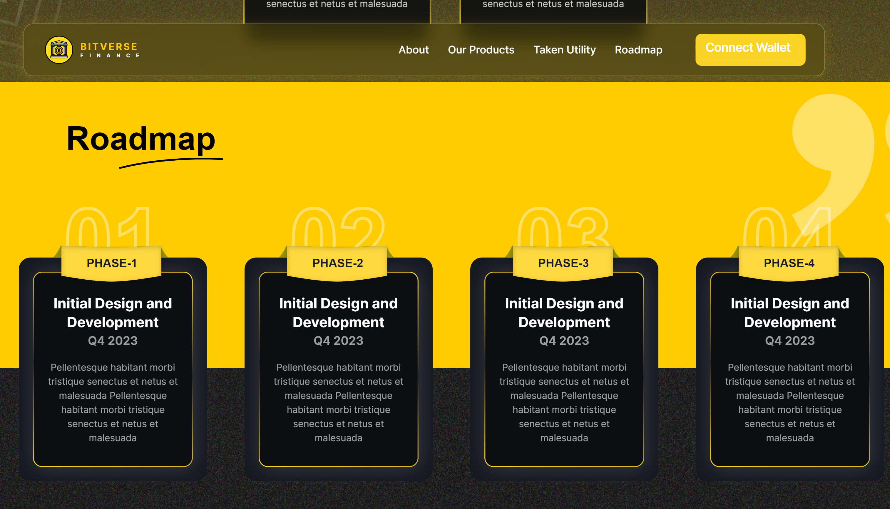
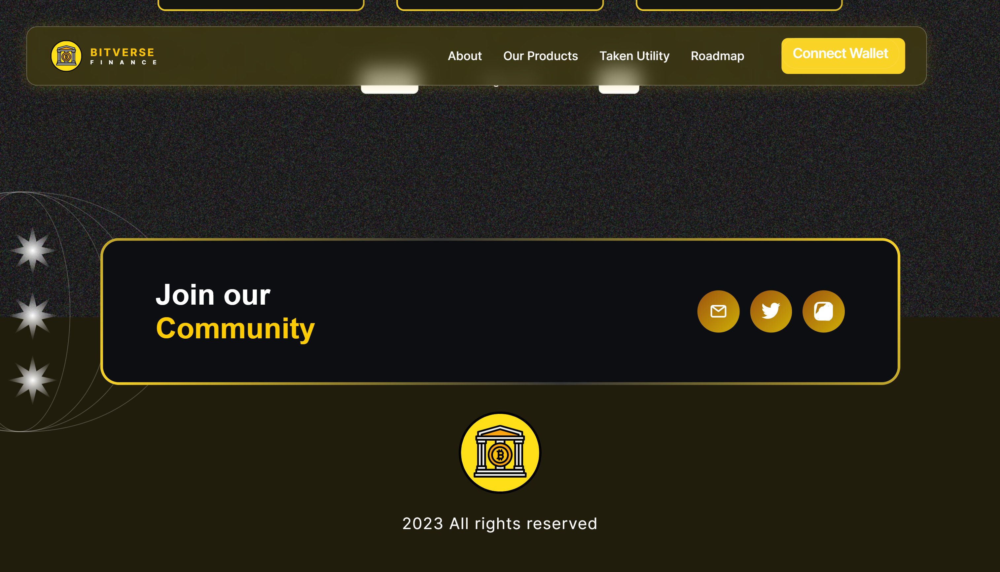

# Bitverse Web Application

A visually appealing web application developed based on the provided Figma design for the MERN Developer Technical Assignment. This application presents Crypto Coins information and enables users to connect their wallets using the WalletConnect tool. It includes a simple backend implemented with Node.js and Express for the Our Token section. The frontend is built using React and styled with Tailwind CSS.


## Figma Design

- Access the [Figma design](https://www.figma.com/file/Z8DFvkPJ8ntFu8jkGpgSc0/Bituniverse?type=design&node-id=0%3A1&mode=design&t=Nm3uK02vsgFOl6OL-1) to review the layout, styling, components, interactions, and animations.

# Screenshots

**Prodcuts Component**


**RoadMap Component**


**Token Component**


**Footer Component**


## Demo Video -  [Click Here]([https://nodejs.org/](https://drive.google.com/file/d/1SLT2CZhL8HV3_RFsMtpplB1i8ZdvP0oV/view?usp=sharing))

## Features

- **Wallet Connection:** Seamlessly connect your wallet using the WalletConnect tool.
- **Backend Integration:** Fetch and display token information from the backend server.
- **Smooth Animations:** Experience smooth transitions and animations for a polished look.


## Prerequisites

Before you begin, ensure you have the following installed:

- [Node.js](https://nodejs.org/)
- [npm](https://www.npmjs.com/)


## Tech Stack

### Front-end:

- **React.js**: Empowering dynamic and interactive components.
- **Tailwind CSS**: For a streamlined and responsive styling approach.

### Back-end:

- **Express.js**: Handling server-side logic efficiently.
- **Node.js**: Providing a robust server-side scripting and runtime environment.

<br>

## Backend Development

### Our Token Section Data Structure

```json
[
  {
    "img": "http://example.com/img1.jpg",
    "tokenName": "AlphaToken",
    "symbol": "ALP",
    "decimals": 18,
    "marketcap": 1000000,
    "chain": "Ethereum"
  },
  // ...other data
]
```


# Project Links

## Front-end:

Explore the live site: [Matrix Labs Frontend](https://matrixlabs.vercel.app/)

## Back-end:

Check out the server: [Matrix Labs Backend](https://matrix-labs-api.onrender.com/data)


# Installation
To set up the project locally, follow these steps:


## 1. For Frontend:

```bash
git clone https://github.com/dev-akhilesh/Akhilesh-Takawale---Frontend-Developer.git
```

```bash
cd client
```

run command in terminal
```
npm install
```

run project
```
npm run start
```


## 2. For Backend:

```bash
git clone https://github.com/dev-akhilesh/Akhilesh-Takawale---Frontend-Developer.git
```

```bash
cd server
```

run command in terminal
```
npm install
```

run project
```
npm run server
```


Feel free to customize the content further based on your specific project details and preferences.
